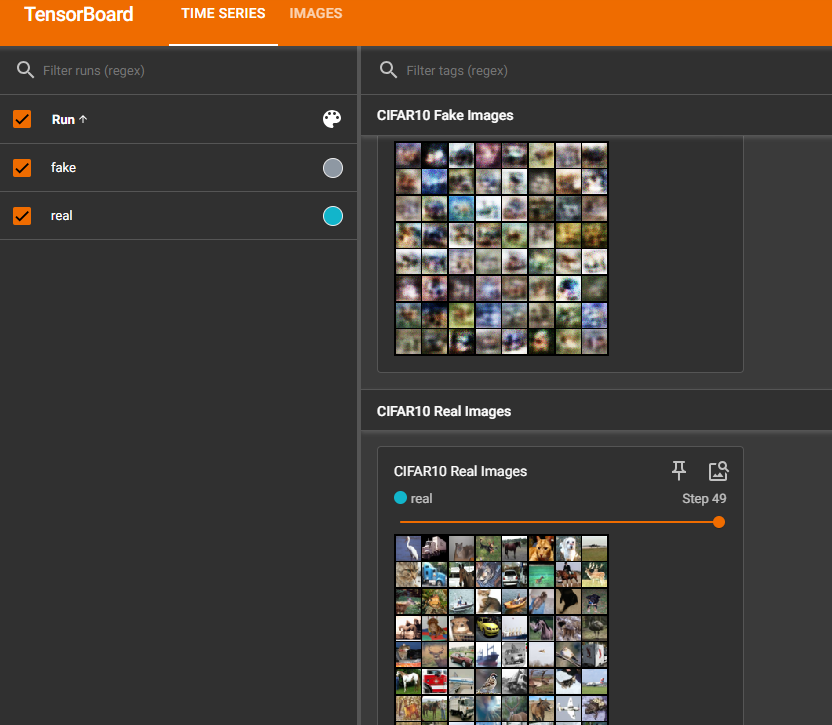

# Generative_Adversarial_network
# Generative Adversarial Network (GAN) on CIFAR-10

## 📌 Project Overview
This project implements a **Generative Adversarial Network (GAN)** using **PyTorch** to generate realistic images from the **CIFAR-10 dataset**.  
The GAN is trained to produce synthetic images that resemble real CIFAR-10 images, using adversarial training between a **Generator** and a **Discriminator**.  
The project also integrates **TensorBoard** for visualizing both fake and real images throughout training.

---

## 🚀 Features
- **PyTorch** implementation of GAN
- **CIFAR-10** dataset for training
- **Generator**: Produces synthetic images from random noise
- **Discriminator**: Classifies images as real or fake
- **Adversarial training loop**
- **TensorBoard** visualization for:
  - Fake images generated by the model
  - Real images from the dataset

---

## 🗂 Dataset
The model is trained on the [CIFAR-10](https://www.cs.toronto.edu/~kriz/cifar.html) dataset, which contains:
- **60,000** images in 10 classes (airplane, car, bird, cat, deer, dog, frog, horse, ship, truck)
- **32×32** RGB images
- Training set: 50,000 images
- Test set: 10,000 images

---

## 📦 Installation

# Install dependencies
pip install torch torchvision tensorboard
```

---

## ▶ Usage
```bash
# Train the GAN
python train.py

# View training progress in TensorBoard
tensorboard --logdir logs
```

---

## 📊 TensorBoard Visualization
During training, the following are logged to TensorBoard:
- **Fake Images** (Generated by the model)
- **Real Images** (From CIFAR-10 dataset)

Example screenshot:  


---

## ⚙ Model Architecture
### Generator
- Input: Random noise vector (latent space)
- Fully connected layers + transposed convolutions
- Batch normalization and ReLU activation
- Output: 3×32×32 RGB image

### Discriminator
- Input: 3×32×32 image
- Convolutional layers with LeakyReLU activation
- Fully connected layers
- Output: Single probability (real/fake)

---

## 📈 Training Details
- **Loss Function**: Binary Cross-Entropy Loss (BCE)
- **Optimizer**: Adam
- **Learning Rate**: 0.0002
- **Batch Size**: 128
- **Epochs**: Adjustable

---

## 🔮 Results
- The model progressively learns to generate realistic CIFAR-10 images.
- Early training produces blurry patterns, but later stages create sharper, more realistic images.
- Fake vs. Real comparison helps track training progress.

---

## 🧠 About GANs
A **Generative Adversarial Network** consists of two models:
1. **Generator (G)** – Learns to produce data similar to the training dataset.
2. **Discriminator (D)** – Learns to distinguish between real and generated data.

They are trained simultaneously:
- **G** tries to fool **D** into classifying fake data as real.
- **D** tries to correctly classify real vs. fake data.

This adversarial setup helps the generator improve over time.

---

